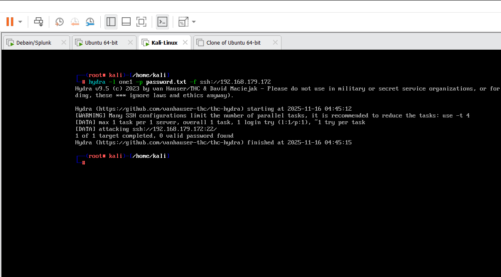

# SSH End-to-End Brute-force Simulation, Detection & Prevention (Splunk)

**Author:** Babar Omkar Sukhdev  
**Institution:** Modern College, Nanded  
**Project Type:** SOC Lab / Academic Project  
**Year:** 2025

---

## 🎯 Project Overview

This project simulates SSH credential brute-force attacks (Hydra) against an Ubuntu target and demonstrates an end-to-end SOC workflow:

1. Generate SSH failed/successful auth events (Hydra).  
2. Ingest Linux `auth.log`into Splunk.  
3. Create correlation searches and alerts for brute-force and password-spray patterns.  
4. Visualize attacker IPs/timelines in Splunk dashboards.  
5. Block attacker IP(s) using UFW/iptables and verify prevention.

---

## 🧩 Lab Topology & Requirements

- **SIEM Server:** Ubuntu 22.04 + Splunk Enterprise (indexes: `auth`, `suricata`)  
- **Target Server:** Ubuntu 22.04 running `sshd` (test target)  
- **Attacker:** Kali Linux (Hydra; Metasploit optional)  
- **Network:** VirtualBox/VMware NAT or internal network  
- **Note:** Perform this lab only in an isolated, authorized environment.

---

## ⚙️ Preparation & Setup

1. **Enable password auth on target (lab only)**  
   Edit `/etc/ssh/sshd_config`:    
      PasswordAuthentication yes
           sudo systemctl restart ssh
   
   2. **Confirm SSH & logs:**  
sudo systemctl status ssh
sudo tail -f /var/log/auth.log

markdown
Copy code

3. **Forward logs to Splunk:**  
- `/var/log/auth.log` → index `auth` (sourcetype `linux_secure` or similar)  
- `/var/log/suricata/eve.json` → index `suricata` (sourcetype `suricata:eve`)

---

## ▶️ Attack Simulation (Kali)

Create a password list:
```bash
cat > /tmp/passlist.txt <<'EOF'
password
123456
admin123
welcome
P@ssw0rd
letmein
qwerty
EOF
Run Hydra (example):

bash
Copy code
hydra -t 4 -V -f -l raj -P /tmp/passlist.txt ssh://<TARGET_IP>
Flags: -t 4 threads, -V verbose, -f stop on success, -l username.
```

---

## 🔎 Splunk Detection Queries (SPL)

**Validate ingestion:**

```index=auth | stats count ```

**Failed SSH logins (top IPs):**

``` index=auth "Failed password" 
| stats count as failed_attempts by src_ip, user
| sort - failed_attempts
```

**Brute-force (more than 5 fails in 10 minutes):**

``` index=auth "Failed password"
| bin _time span=10m
| stats count by src_ip, _time
| where count > 5
```

**Password-spray detection (many users, low attempts each):**

``` index=auth "Failed password"
| stats dc(user) as unique_users, count as total_fails by src_ip
| where unique_users > 5 AND total_fails < 20
```

**Correlate with Suricata:** 

``` index=auth "Failed password" OR index=suricata
| transaction src_ip maxspan=1h
| table _time, src_ip, user, dest_ip, dest_port, signature
```

---

## 🚨 Alerts & Saved Search Example

Saved search (runs every 10 minutes):
```
[SSH Brute Force - >5 Fails in 10m]
source="auth.log" host="ubuntu" index="main" sourcetype="auth" rhost="192.168.179.160"
cron_schedule = */10 * * * *
action.email = 1
action.email.to = your@email
alert.severity = high

```

---

## 🔧 Response & Prevention
**Block attacker IP (UFW):**
```
sudo ufw insert 1 deny from <src_ip> to any port 22 proto tcp
```


**Or iptables:**
```
sudo iptables -I INPUT -s <src_ip> -p tcp --dport 22 -j DROP
```


**Verify with:**
```
sudo ufw status numbered
# or
sudo iptables -L -n --line-numbers

```

---

## 🔥 Hydra Brute-force Attack

